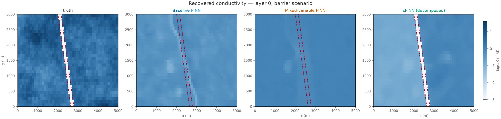
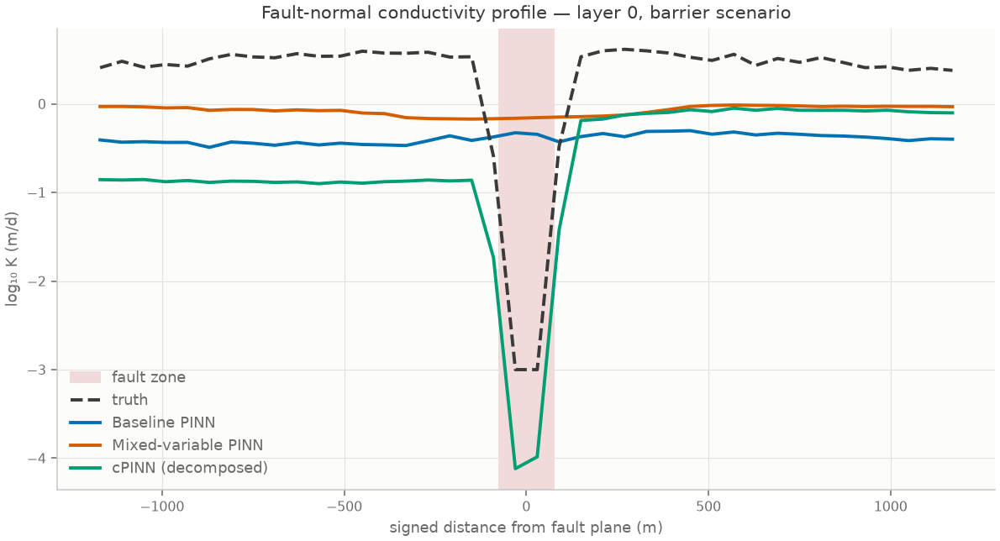
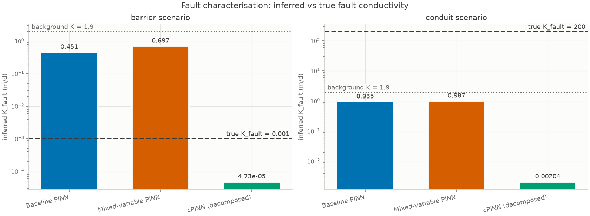

# Results

Three inverse-PINN architectures, two fault scenarios, identical data and
identical training budget. Every number below comes from
`runs/study/results.json`; regenerate with the commands at the bottom.

**Budget.** 6000 Adam iterations + 150 L-BFGS, 1500 collocation points,
float64, 4 CPU cores (each scenario run as a 2-thread process). Wall time
70–71 min per scenario; 13–36 min per model.

---

## Headline

1. **The distributed 3D conductivity field is not recovered — by any
   architecture.** Every run scores *worse* than predicting a single constant.
2. **The fault's lumped hydraulic property is recoverable — but only for the
   barrier, and only by the cPINN.** 1 correct classification out of 6 runs.
3. **The cPINN's failure on the conduit is structural, not a tuning problem.**
   A conduit carries 3.2× more flow *along* its plane than across it, and a
   zero-thickness leaky wall parameterises only cross-plane resistance.
4. **The mixed-variable formulation reproduces heads best**, 30–35% below the
   baseline in both scenarios, consistent with avoiding second derivatives
   across the discontinuity.
5. **Both design choices in the cPINN are load-bearing, and one of them is
   doing more work than the data.** Replacing the leaky wall with textbook head
   continuity breaks the barrier identification and doubles head RMSE; removing
   the Tikhonov prior collapses K to its lower bound. The prior sweep shows the
   recovered bulk conductivity tracks the prior rather than the truth.

---

## Main comparison

### Scenario A — barrier

True K<sub>fault</sub> = 10⁻³ m/d, true bulk K = 1.93 m/d, true contrast
−3.29 log₁₀ units, true head jump **6.74 m**.

| architecture | head RMSE (m) | head RMSE unobs. (m) | log₁₀K RMSE (bulk) | K bulk (m/d) | K fault (m/d) | contrast log₁₀ | head jump (m) | verdict | time (s) |
| --- | --- | --- | --- | --- | --- | --- | --- | --- | --- |
| baseline | 1.777 | 1.783 | 0.907 | 0.427 | 0.451 | +0.024 | 3.67 | neutral ✗ | 1296 |
| mixed | 1.166 | 1.170 | 0.699 | 0.906 | 0.697 | −0.114 | 2.09 | neutral ✗ | 787 |
| **cPINN** | **1.126** | 1.129 | 1.034 | 0.331 | **4.73 × 10⁻⁵** | **−3.845** | **8.76** | **barrier ✓** | 2181 |

### Scenario B — conduit

True K<sub>fault</sub> = 200 m/d, true bulk K = 1.93 m/d, true contrast
+2.01 log₁₀ units, true head jump **0.073 m**.

| architecture | head RMSE (m) | head RMSE unobs. (m) | log₁₀K RMSE (bulk) | K bulk (m/d) | K fault (m/d) | contrast log₁₀ | head jump (m) | verdict | time (s) |
| --- | --- | --- | --- | --- | --- | --- | --- | --- | --- |
| baseline | 0.477 | 0.478 | 0.698 | 0.902 | 0.935 | +0.016 | −0.046 | neutral ✗ | 1286 |
| **mixed** | **0.312** | 0.313 | **0.687** | 0.941 | 0.987 | +0.021 | **0.095** | neutral ✗ | 773 |
| cPINN | 0.599 | 0.601 | 0.698 | 0.908 | 0.00204 | −2.648 | 2.006 | barrier ✗ | 2162 |

---

## Finding 1 — the conductivity field is not recovered

This is the result that matters most, and it is negative.

The true background `log₁₀ K` has mean +0.286 and standard deviation 0.615.
So a model that ignored the data entirely and predicted a single constant would
score:

| reference predictor | log₁₀K RMSE (background) |
| --- | --- |
| constant at the true mean | **0.615** |
| constant at the prior (1 m/d) | 0.678 |

Against that, the six trained models score **0.687, 0.698, 0.698, 0.699, 0.907
and 1.034**. Not one of them beats a constant field. The inversion recovers
essentially no information about K heterogeneity.

Every model also under-estimates bulk conductivity — 0.33 to 0.94 m/d against a
true 1.93 — so the degenerate "shrink K" direction is still acting even after
the conditioning work described in [`METHOD.md`](METHOD.md) §5.

This is not a tuning failure but a statement about the experiment. 1110 head
values on a 4500-cell × 37-timestep grid is **0.67% coverage**; a free
conductivity field at that density is massively underdetermined, which is
exactly why practical hydrogeological inversion uses pilot points or zonation
rather than an unconstrained field. Reporting the recovered field as a success
would require quoting `log₁₀K RMSE ≈ 0.69` without the constant-field reference
beside it.



---

## Finding 2 — the fault *is* identifiable, as a lumped parameter

The picture changes completely when the fault is represented as an explicit
interface unknown rather than as a feature that must emerge from a K image.



Binned on signed distance from the fault plane, the truth is a step from
`log₁₀ K ≈ +0.5` down to `−3`. The baseline and mixed models are **flat lines** —
they place no fault there at all. The cPINN recovers the step, overshooting
slightly to −4.1 against a true −3.

The cPINN's estimate comes from its leakance parameter, `K_f = Γ·K₀·w/L0`,
not from grid cells:

- inferred **4.73 × 10⁻⁵ m/d** against a true **10⁻³ m/d** — 1.3 log₁₀ units low,
- contrast **−3.85** against a true **−3.29**,
- and it is the only model to reproduce the head jump at the right order
  (8.76 m against 6.74 m; the others give 2.1–3.7 m).

So the direction and order of magnitude are right and the classification is
correct, but the magnitude is biased low. That bias is expected and is a
property of the physics, not the optimiser: once the fault is strongly
resistive the cross-fault flux is near zero, and `Q_n = Γ·ΔH` is then satisfied
by *any* sufficiently small `Γ`. **The data constrain an upper bound on
leakance, not a point value.**



---

## Finding 3 — why the cPINN fails on the conduit

The cPINN labels the conduit a *barrier* — the worst possible answer. It is
worth being precise about why, because the cause is structural.

Summing inter-cell flows in the benchmark truth at the final timestep:

| scenario | flow **across** the fault | flow **along** the fault | ratio | head drop across |
| --- | --- | --- | --- | --- |
| barrier | 8.1 m³/d | 1.6 m³/d | 0.20 | **3.011 m** |
| conduit | 3034 m³/d | **9711 m³/d** | **3.20** | **0.028 m** |

A barrier's hydraulic role is to *resist flow across itself*, and that is
exactly what the leaky-wall condition `Q_n = Γ(H_w − H_e)` parameterises. The
model class matches the physics, and the parameter is identifiable.

A conduit's role is the opposite: it is a **pipe in its own plane**, carrying
3.2× more flow along strike than across. A zero-thickness interface has no
tangential transmissivity, so this behaviour is **outside the model class
entirely**. Worse, the identifying ratio `Γ = Q_n/ΔH` has `ΔH = 0.028 m` —
below twice the 0.015 m observation noise — so `Γ` is numerically
unidentifiable from these data even in principle.

The consequence is visible in the head jump: the cPINN manufactures a **2.0 m**
jump across a fault whose true jump is **0.073 m**, because a small `Γ` demands
one. The mixed model, which makes no structural assumption about the fault,
gets that jump nearly right (0.095 m) — it simply cannot say what K produced it.

**The fix is known and not implemented here:** a conduit needs a discrete-
fracture interface carrying an in-plane Darcy law with its own tangential
transmissivity, rather than a leaky wall. The leaky wall is the correct
homogenisation for a barrier and the wrong one for a conduit; a general fault
model needs both terms.

---

## Finding 4 — mixed-variable beats the baseline on the state

| scenario | baseline head RMSE | mixed head RMSE | change |
| --- | --- | --- | --- |
| barrier | 1.777 m | 1.166 m | **−34%** |
| conduit | 0.477 m | 0.312 m | **−35%** |

Consistent across both scenarios, and it comes with a ~40% *lower* cost per run
(773–787 s against 1286–1296 s) because the first-order residuals need no
nested autograd. The mixed formulation is the better default for the forward
state even though it does not, on its own, solve the fault problem.

The cPINN reproduces the barrier state slightly better still (1.126 m) but is
the most expensive model by a factor of ~2.8.

---

## Ablation 1 — the interface condition is load-bearing

The cPINN's leaky-wall condition is a deliberate departure from the textbook
conservative-PINN interface, which imposes continuity of both flux *and*
solution. This ablation re-runs the barrier scenario with only that condition
changed (4000 Adam iterations, everything else identical).

| interface condition | head RMSE (m) | **predicted head jump (m)** | K fault (m/d) | contrast log₁₀ | verdict |
| --- | --- | --- | --- | --- | --- |
| `conductance` — leaky wall | **1.147** | **9.26** | 2.0 × 10⁻⁵ | −4.00 | **barrier ✓** |
| `continuity` — `H_w = H_e` | 2.281 | **0.176** | 0.0960 | −0.15 | neutral ✗ |

True head jump: **6.74 m**.

The mechanism is visible directly in the head field. Imposing `H_w = H_e`
forces the predicted jump to **0.176 m** where the truth is **6.74 m** — the
model class simply cannot express a barrier. Two consequences follow:

- the fault verdict flips from correct to wrong, and
- **head RMSE doubles** (1.147 → 2.281 m). The constraint is not merely
  uninformative about the fault, it is actively harmful to the state, because
  the model must distort the head field everywhere to satisfy an interface
  condition the data contradict.

This is why `conductance` is the default. `--interface-mode continuity` is kept
so the failure can be reproduced rather than taken on trust.

Note the symmetry with Finding 3: strict continuity is the wrong model class
for a *barrier*, and the leaky wall is the wrong model class for a *conduit*.
Neither is universal, and a fault interface that handles both needs a
cross-plane leakance **and** an in-plane transmissivity.

## Ablation 2 — how much of the answer is the prior?

Finding 1 claims the conductivity field is not recovered. This sweep is the
test of that claim: it varies the Tikhonov prior's bulk value over two orders of
magnitude, and turns it off entirely, on the barrier scenario with the
mixed-variable architecture (4000 Adam iterations).

If the data constrained bulk K, the recovered value would be insensitive to the
prior. It is not.

| prior bulk K (m/d) | recovered bulk K (m/d) | log₁₀ | log₁₀K RMSE | head RMSE (m) |
| --- | --- | --- | --- | --- |
| 0.1 | 0.0946 | −1.02 | 1.448 | 1.158 |
| 1.0 *(default)* | 0.768 | −0.11 | 0.740 | 1.359 |
| 10.0 | 0.542 | −0.27 | 0.840 | 2.736 |
| **none** | **0.000283** | **−3.55** | 3.883 | 1.709 |
| *truth* | *1.933* | *+0.286* | — | — |

Three things follow, and the third is the one that matters.

**Without the prior, K collapses.** Turning it off drives bulk conductivity to
2.8 × 10⁻⁴ m/d — essentially the lower bound of the bounded parameterisation,
3.8 log₁₀ units below the truth. The degenerate direction described in
[`METHOD.md`](METHOD.md) §5 wins outright. The prior is not a refinement; without
it the inversion does not produce a usable answer at all.

**The physics constrains K from above but not from below.** A prior of 0.1 is
accepted almost unchanged (0.095), whereas a prior of 10 is dragged down to
0.54. So there *is* information in the residual — it refuses a conductivity that
is too large — but that ceiling sits at roughly 0.5–0.8 m/d, which is itself
**below** the true 1.93 m/d. The data never push K up towards the truth.

**Therefore the recovered bulk conductivity is set by the regularisation, not by
the data.** Across the whole sweep no setting recovers the true 1.93 m/d, and
the answer moves with the prior wherever the prior is below the physics ceiling.
Reporting the default run's `K bulk = 0.77 m/d` as an inversion result would be
reporting the prior back, lightly modified.

This is the evidence behind Finding 1, and it is why the constant-field
reference is quoted there rather than a bare RMSE. It also bounds how much the
fault result can be trusted: the cPINN's barrier identification survives because
it rests on an **interface parameter** constrained by the head jump — a quantity
the data measure directly at 6.74 m against 0.015 m noise — and not on the
conductivity field, which is not constrained at all.

## What this study does and does not establish

**Established.**
- The lumped hydraulic property of a barrier fault is recoverable from sparse
  transient heads, by an architecture that represents it as an explicit
  interface unknown. None of the free-field architectures recover it.
- The distributed 3D conductivity field is not recoverable at 0.67% coverage,
  by any of the three.
- The first-order mixed formulation reproduces heads better and faster than the
  second-order baseline.
- A leaky-wall interface is structurally incapable of representing a conduit,
  and strict head continuity is structurally incapable of representing a
  barrier. Both are demonstrated, not asserted.
- The recovered bulk conductivity is set by the Tikhonov prior, not by the data;
  without the prior the inversion collapses to its lower bound.

**Not established.**
- Whether a longer budget would change the K-field conclusion. 6000 Adam
  iterations is modest; the head misfit was still falling slowly at the end.
  The constant-field comparison is the robust part of the claim, since the
  models are *worse* than a constant rather than marginally better.
- Anything about MODFLOW-specific behaviour: the numbers come from the bundled
  reference solver (see the provenance note in the README), which is validated
  against Theis and the 1-D series-resistance law but is not MODFLOW 6 itself.
- Generalisation beyond this geometry, one noise level and one random seed.
  Every run is seed 0; no repeat-seed spread is reported.

---

## Reproducing

```bash
python scripts/01_generate_benchmark.py

# one process per scenario uses 4 cores better than one process in series
OMP_NUM_THREADS=2 python scripts/03_run_study.py --scenarios barrier \
    --adam 6000 --lbfgs 150 --collocation 1500 --outdir runs/study_barrier &
OMP_NUM_THREADS=2 python scripts/03_run_study.py --scenarios conduit \
    --adam 6000 --lbfgs 150 --collocation 1500 --outdir runs/study_conduit &
wait

python scripts/05_merge_study.py runs/study_barrier runs/study_conduit \
    --outdir runs/study
python scripts/04_ablations.py --which interface --scenarios barrier
```
