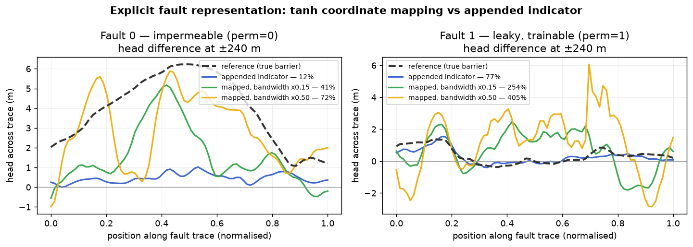

# Explicit fault representation by coordinate mapping

The baseline model reproduces the head field well but **fails to reproduce the
step across an impermeable fault** — it recovers 4–12% of the reference throw.
This documents a test of a targeted fix: instead of appending the fault
indicator as an extra input, *map the coordinates themselves* through
`tanh(signed distance / barrier width)`.

## The two representations

Both use the same quantity, `u_f(x) = tanh(s_f(x) / w)`, where `s_f` is the
signed distance to fault `f` and `w` is the barrier width. They differ in where
it enters.

**Appended indicator** (`model.fault_coords: false`, the baseline)

```
features = [ x, y, γ(x, y), u₁ … u_F ]
```

The Fourier embedding γ sees only the physical coordinates, so **every basis
function the network has is smooth across the fault**. The network can build a
jump by leaning on `u`, but it is doing so against the grain of its own
representation.

**Coordinate mapping** (`model.fault_coords: true`)

```
ξ = [ x, y, u₁ … u_F ]        features = [ ξ, γ(ξ) ]
```

The fault coordinates are inputs to the embedding, so the basis functions
themselves turn over within a barrier width. Two points a metre apart on
opposite sides of a barrier are far apart in ξ, and a smooth function of ξ is a
near-discontinuous function of `(x, y)`.

`tanh` is the natural map here: it saturates to ±1 away from the trace, it lands
in the same range as the normalised coordinates, and its transition width is
exactly the width the physics smears the head drop over — so the coordinate map
and the anisotropy tensor agree on the length scale.

Both modes present the backbone the same number of inputs, so the comparison is
not confounded by capacity (`tests/test_models.py`).

## The bandwidth has to be reduced, or it diverges

The first attempt gave the mapped coordinates the same Fourier bandwidth as
`x, y`, and **training diverged** — the PDE loss climbed from 2.5×10³ to
1.5×10⁵ over 250 iterations, and the initial residual was five orders of
magnitude above the baseline.

The reason is that `u` already changes by 2 over roughly one barrier width. A
frequency-6 band on `u` therefore oscillates about six times *inside* the
barrier, giving wavelengths of order 20 m. The flow residual is second order, so
that curvature enters squared, and the optimiser responds by flattening the
field everywhere.

The fix is a per-dimension bandwidth (`model.fault_sigma_scale`): the map
supplies the sharpness, so the embedding must not multiply it. Measured
concentration of across-fault gradient at initialisation (mean |∂h/∂n| just
inside the barrier over the same far from it, 6 seeds):

| representation | across/away gradient ratio |
|---|---|
| appended indicator | 1.03 |
| mapped, bandwidth ×0.05 | 1.05 |
| mapped, bandwidth ×0.15 | 1.81 |
| mapped, bandwidth ×0.50 | 4.87 |
| mapped, bandwidth ×1.0 | 9.78 — *diverges in training* |

## Results

`resnet`, 1200 Adam iterations, identical data, seed and loss settings; only the
fault representation differs.

**Head and property fields**

| representation | calibration RMSE (m) | held-out RMSE (m) | held-out R² | head field RMSE (m) | head field R² | log10 T RMSE |
|---|---|---|---|---|---|---|
| appended indicator | 0.070 | **1.142** | **0.896** | **1.246** | **0.827** | **0.573** |
| mapped, bw ×0.15 | 0.341 | 1.160 | 0.892 | 2.017 | 0.547 | 1.110 |
| mapped, bw ×0.50 | 0.510 | 1.729 | 0.761 | 2.631 | 0.229 | 1.635 |

**Head step held up across each fault** (paired heads at ±240 m, predicted /
reference, and the fraction recovered)

| representation | fault 0 — impermeable | fault 1 — leaky (α ≈ 0.05) |
|---|---|---|
| appended indicator | 0.46 / 3.96 m — **12%** | 0.36 / 0.47 m — **77%** |
| mapped, bw ×0.15 | 1.63 / 3.96 m — **41%** | 1.18 / 0.47 m — **254%** |
| mapped, bw ×0.50 | 2.86 / 3.96 m — **72%** | 1.89 / 0.47 m — **405%** |



## What this says

**The mapping does what it was meant to do.** On the impermeable fault it takes
step recovery from 12% to 72%. The baseline's failure to reproduce a barrier is
a representational limit, not only a data limit, and mapping the coordinate
removes that limit.

**It buys that with three costs.**

1. **The global solution degrades.** Head-field R² falls 0.827 → 0.547 → 0.229
   and transmissivity error nearly triples. The steeper basis makes the
   second-order residual much stiffer, and the optimiser spends its budget
   fighting it.
2. **The recovered step is noisy, not faithful.** The figure shows the mapped
   runs oscillating along the trace where the reference profile is smooth. The
   map makes a jump *available* at every station along every fault, and an
   under-determined inversion fills that freedom with noise. Getting the
   magnitude right is not the same as getting the barrier right.
3. **It manufactures steps that are not there.** On the leaky fault, where the
   true throw is 0.47 m and the appended indicator gets it to within 23%, the
   mapped runs produce 254–405% of it. The bias toward discontinuity is applied
   to every fault in the shapefile, whether or not that fault is a barrier.

**Held-out RMSE hides most of this.** At bandwidth ×0.15 it is 1.160 m against
the baseline's 1.142 m — indistinguishable on 12 wells. A practitioner without a
reference solution would see step recovery improve from 12% to 41% at apparently
no cost, and would not see the head field quietly getting worse. That is a good
argument for keeping paired observations across any fault you care about.

## Recommendation

`fault_coords` stays **off by default**. Turn it on when:

- a fault is *known* to be a strong barrier and reproducing its throw is the
  point of the study — compartmentalisation, containment, a fault-bounded
  wellfield; and
- there are observations either side of it to pin the step down, so the extra
  freedom is constrained rather than filled with noise.

Start at `fault_sigma_scale: 0.15` and only raise it if the step is still short,
watching the head-field metrics as you do. Do not use full bandwidth.

```yaml
model:
  fault_coords: true
  fault_sigma_scale: 0.15
```

## Reproducing

```bash
python scripts/train.py sample_data/config.yaml -o runs/fc_off \
    --arch resnet --no-fault-coords --iters 1200 --lbfgs 0
# then edit model.fault_coords / model.fault_sigma_scale in a copy of the config
python scripts/compare_fault_representation.py runs/fc_off runs/fc_on_015 runs/fc_on_050
```

The `faults` block of `report.json` carries the step metrics; `plot_fault_steps`
draws the profile along each trace.
